# 用户说明
## 1 引言

本文档主要介绍如何使用Quectel_Quecthing_SN&IMEI绑定工具，对移远模组的IMEI和云平台的SN进行绑定。绑定后生成相应的csv文件后，导入云平台进行。

## 2 使用流程
### 2.1 打开程序

如**图 1**所示，用户打开程序后，程序将自动加载上一次关闭前的记录，同时弹出提示框，提示点击前三列才可出现扫码输入框。最后一列为设备名称，当前不做设置。
>注：当前为一页2000行的显示，限制总页数为25页。由于程序启动时，需加载历史数据，如果数据过大，程序将延长加载时长。

    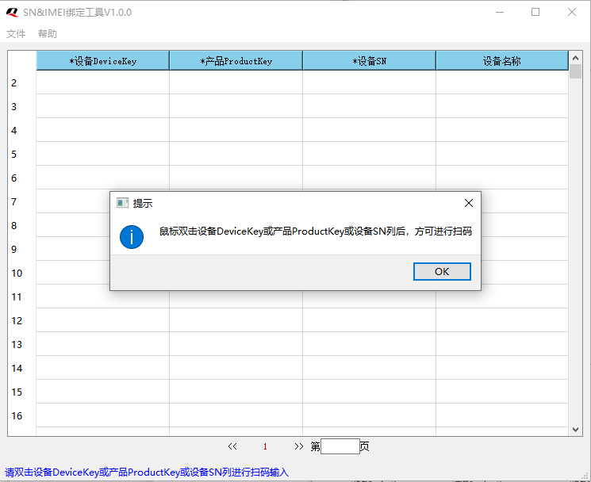
    
图1

### 2.2 扫码输入
如**图 2**所示，鼠标双击前3列弹出消息框，并提示内容。若点击第一列，则消息为”请扫描模组二维码”。若点击第二或第三列且第一列不为空时，则消息为”请扫描设备二维码”；若点击第二或第三列且第一列为空时，则提示“请先点击设备DeviceKey列进行扫描”。若当前无需输入，则可点击退出按钮，将退出改窗口。
> 注：用户需要扫码时，请确保输入框是否已显示为可编辑状态（即有光标处于闪动状态）。

    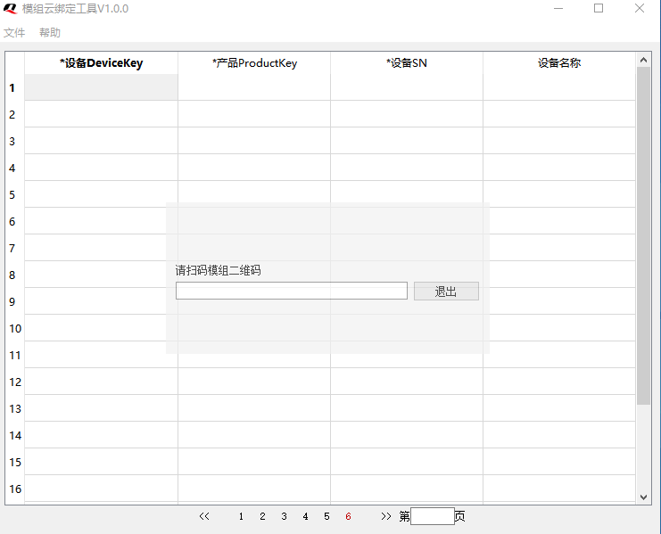
    
图2

若输入出错或扫码错误，则如图 3所示。

    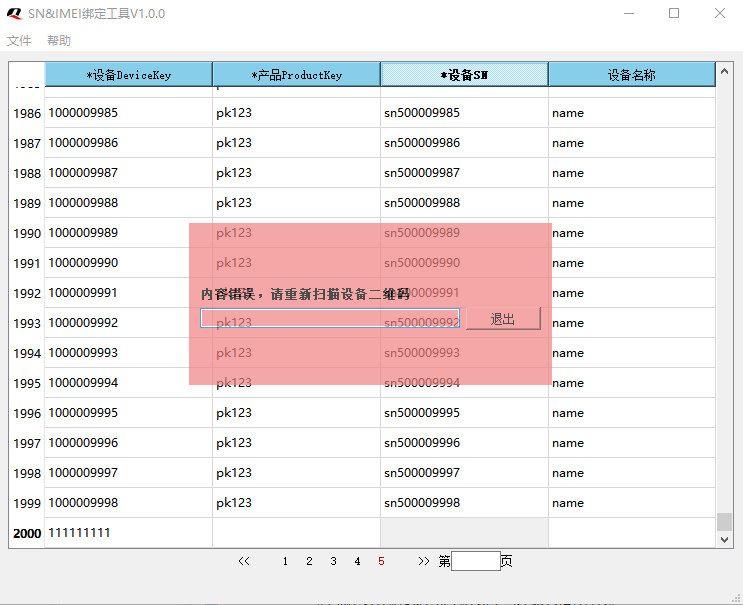
    
图3

### 2.3 文件操作-导入
文件导入时，不对数据进行具体检测，只检测其整体格式。

**步骤一：** 
>如**图 4**所示，点击左上角的“文件”，再点击“导入”。

    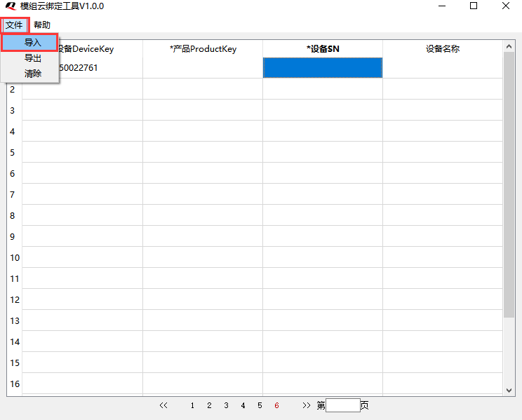
    
图4

**步骤二：**
>如**图 5**所示，若当前记录为非空，则会弹窗提示是否覆盖当前记录；否则，跳到步骤三。

    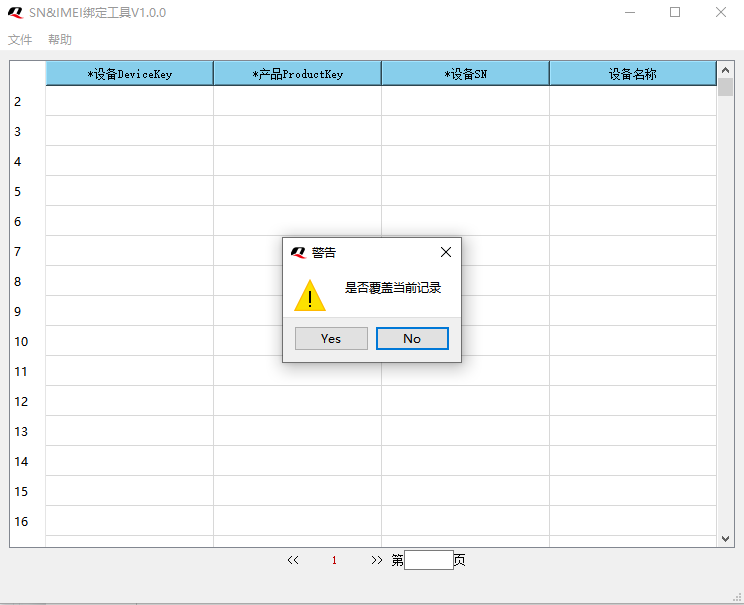
    
图5

**步骤三：**
>如**图 6**所示，弹出弹窗显示windows下的.csv文件，并选择导入。

    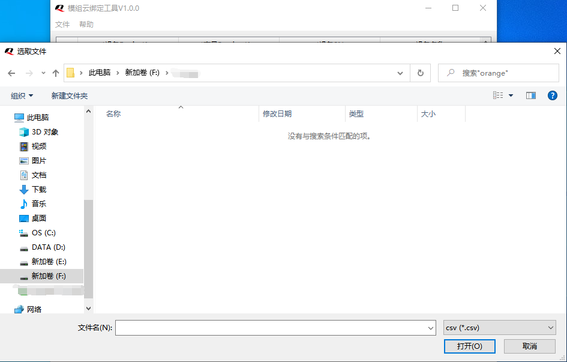
    
图6

**步骤四：**
>如**图 7**和**图 8**所示，当文件校验成功100%后，在写入文件的进度条达到100%即可。

    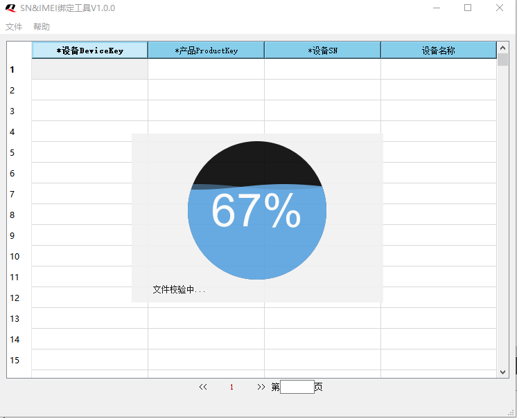
    
图7

    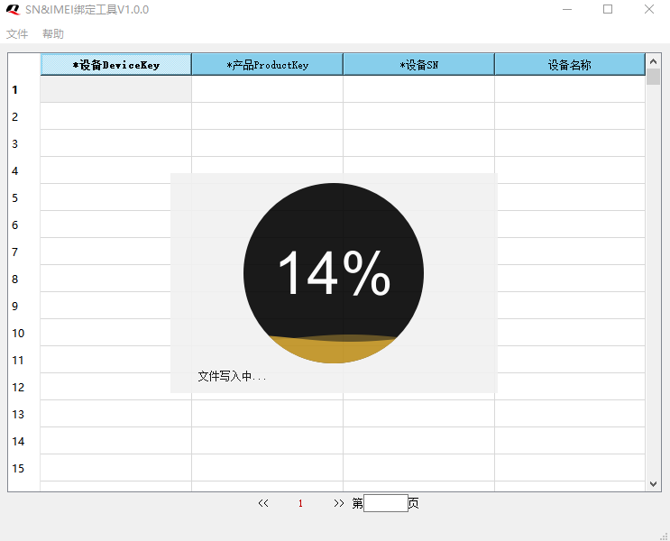
    
图8

### 2.4 文件操作-导出
如**图 9**所示，点击左上角的“文件”，再点击“导出”。输入导出的文件名，再点击保存按钮后，弹出如**图 10**所示的弹窗，则保存成功。

    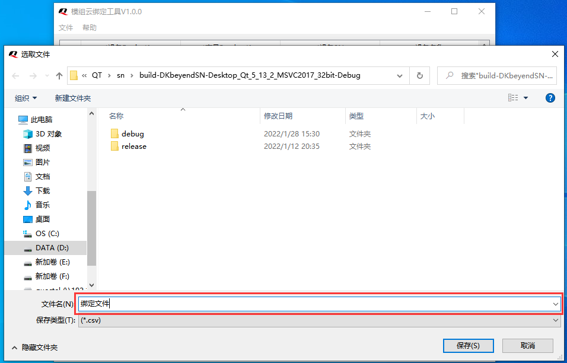
    
图9

    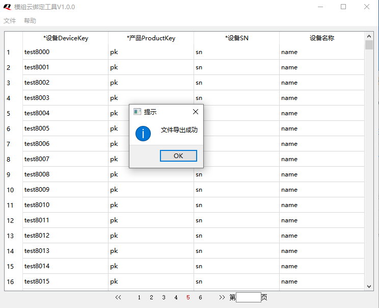
    
图10

### 2.5 文件操作-清除
如**图 11**所示，点击左上角的“文件”，再点击“清除”后，若当前所选择的数据不为空，则弹出如图 12所示的弹窗，用户根据实际要求点击，若点击”yes”,则清除当前所有数据，点击”no”或关闭窗口，则为取消。

    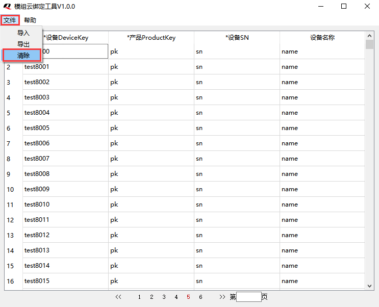
    
图11

    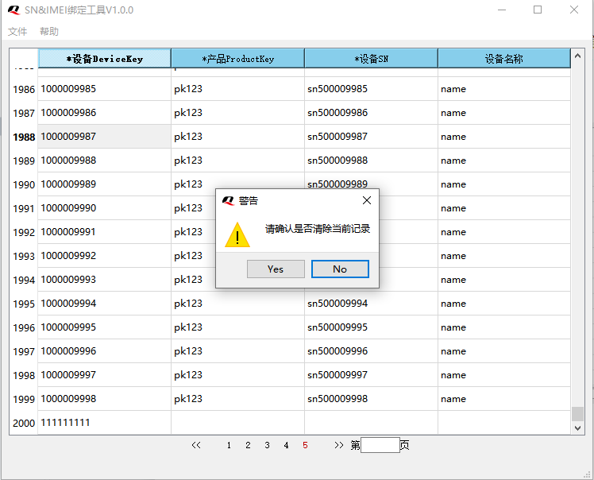
    
图12

### 2.6 数据删除
如**图 13**选择需要删除的表格行（可多选），右键将弹出菜单栏，再点击删除即可删除数据。

    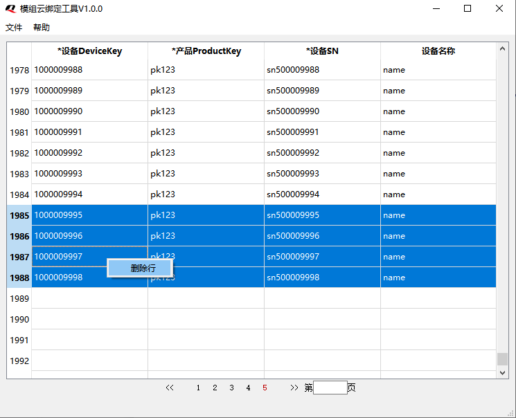
    
图13

### 2.7 帮助文档
点击左上角的“帮助”，如**图 14**、**图 15**所示弹出当前帮助手册。

    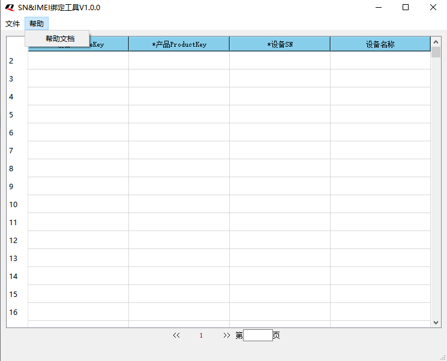
    
图14

    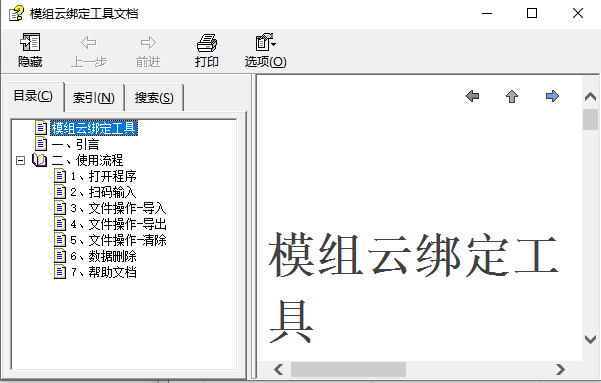
    
图15

